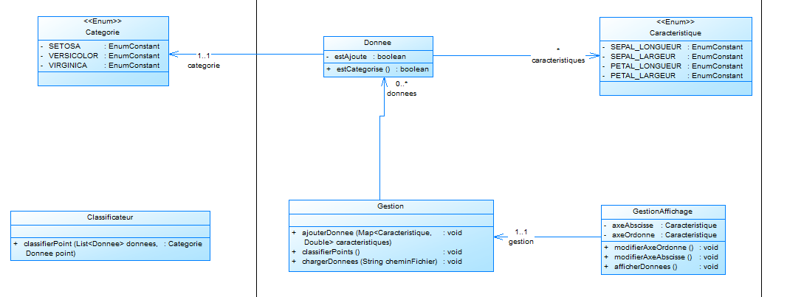

### Équipe 

#### Groupe : J3
#### Membres :

-   GOSSELIN Maxime
-   ROYER Baptiste
-   LEFEBVRE Florine
-   COLLUMEAU Nathanaël
 
### Organisation du travail

*Pour chaque membre de l'équipe, préciser en 2--3 lignes:*

Maxime :

	Je me suis occupé en partie du diagramme des classes et de la réalisation sur
	PowerAmc.
	Dans le projet, je vais m'occuper des vues.

Nathanaël :

	J'ai participé à la conception du diagramme de classes et je réalise actuellement le développement du modèle.

Florine :

	J'ai réalisé le diagramme de cas d'utilisation avec visual Paradigm et je code la partie gestion.

Baptiste :

	J'ai réalisé la maquette prototype de l'application, ainsi que le fichier pom.xml.
	Dans le projet, je vais également m'occuper des tests.

- *Comment il ou elle a contribué au projet dans son ensemble.*
- *Comment il ou elle a contribuer plus particulièrement au dossier d'analyse.*

## Diagramme de cas d'utilisation

### Fiches descriptives : Charger données

Système : Algorithme k-NN
Cas d’utilisation : Charger données

Acteur Principal : Utilisateur
Autre acteurs : N/A

Précondition : Aucune

Garantis en cas de succès : Les données sont chargées et affichées sur le graphique
 
 
Garanties minimales : Aucune

Scénario nominal : 
1. L’utilisateur sélectionne la fonctionnalité “Charger données”.
2. Le système ouvre une fenêtre de recherche de fichier. en n’affichant uniquement les .csv.
3. L’utilisateur sélectionne un fichier à charger.
4. Le système vérifie la validité des données (fichier non-vide, 5 colonnes, aucune données manquante) charge le lot de données et affiche le nuage de points.

Scénario alternatif : 
* Scénario alternatif A
	* A4. Le système trouve que le fichier n’est pas valide (fichier vide etc...). Il affiche un message d’erreur et ferme la fenêtre de sélection de fichier.

### Fiches descriptives : Ajouter une donnée

Système : Algorithme k-NN

Cas d’utilisation : Ajouter une donnée

Acteur Principal : Utilisateur

Autre acteurs : N/A

Précondition : Avoir chargé les données

Garantis en cas de succès : La donnée s’ajoute au graphique

Garanties minimale : L’utilisateur est informé que la donnée n’a pas été ajoutée

Scénario nominal : 
1. L’utilisateur sélectionne la fonctionnalité “Ajouter un point”.
2. Le système affiche une nouvelle fenêtre comportant la liste des attributs de la nouvelle donnée à remplir sauf la catégorie.
3. L’utilisateur remplit les données et valide.
4. Le système ajoute la donnée au graphique en tant que point non-classifié.

Scénario alternatif : 
* Scénario alternatif A : dans l’étape 3, l’utilisateur remplit des données invalides et valide.
    * 4(A). Le système n’ajoute pas la donnée et informe l’utilisateur.

### Fiches descriptives : Ajouter une donnée

Système : Algorithme k-NN

Cas d’utilisation : Classifier les données non-classifiées

Acteur Principal : Utilisateur

Autre acteurs : N/A

Précondition : Avoir chargé les données.

Garantis en cas de succès : Les données sont classifiées.

Garanties minimale : N/A

Scénario nominal : 
1. L’utilisateur sélectionne la fonctionnalité “Classifier les points”.
2. Le système récupère tous les points placés et non-classifiés et les range dans les catégories adéquates en fonction de leurs caractéristiques et met à jour l’affichage.

Scénario alternatif :
*	Scénario alternatif A:
	*	A2. Le système n’a pas de points à classifier, il informe l’utilisateur qu’il n’y a pas de point à classer.

### Prototypes pour l'interface

*Inclure des prototypes de l'interface utilisateur pour ces fonctionnalités:*

- *Ajouter une donnée*
- *Classifier la donnée non classifiée*
- *Modifier les attributs pour l'affichage*

*Chaque prototype est constitué d'une suite d'écrans, ou d'une arborescence d'écrans si plusieurs chemins d'interaction sont possibles.*

*Pour les deux fonctionnalités dont on demande le prototype et la fiche descriptive, vous ferez le lien entre le prototype et la fiche descriptive. Plus précisément, pour chaque étape de la fiche descriptive, vous indiquerez à quel écran elle correspond. Vous pouvez par exemple mettre une légende sous l'écran, par ex. "Écran pour l'étape 3 de la fiche descriptive du UC Ajouter une donnée."*

*Les prototypes peuvent être en faible fidélité.*

*Les prototypes peuvent être dessinés à la main ou générés en utilisant un logiciel. Dans les deux cas, veillez à ce que les images soient lisibles et avec une bonne résolution (possibilité de zoomer pour lire le texte qui s'y trouve).*

## Diagramme de classes

*Inclure un diagramme de classes qui permet d'**implémenter toutes les fonctionnalités**.*

*Le diagramme de classes doit suivre le design pattern MVC, mais vous ne ferez pas figurer les classes de la vue. Il doit être clair quelles classes font partie du contrôleur (par exemple grâce à un nom de classe qui contient 'Controleur'); les classes restantes seront considérées faisant partie du modèle.*

*L'image du diagramme doit être de résolution suffisante permettant de zoomer et lire le texte qui y figure.*

### Maquette de l'application

*Capture d'écran de la maquette :*
**Page contenant les axes avec les catégories :**

**Page contenant l'interface d'ajout de points selon les caractéristiques :**

[Lien vers la maquette](https://www.figma.com/design/SZzkTVj4p9skO4ShVvjGIm/Untitled?node-id=0-1&m=dev&t=aAGkD03vyZg0CiOn-1)
